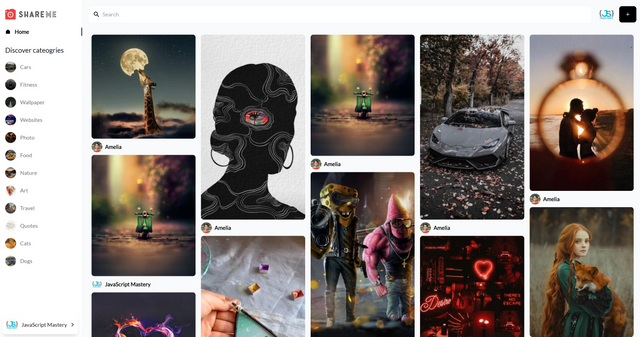
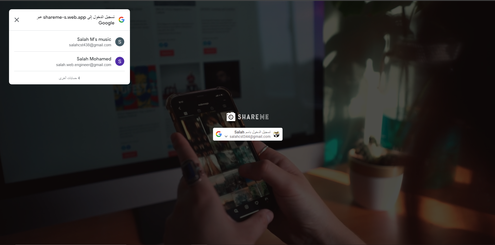
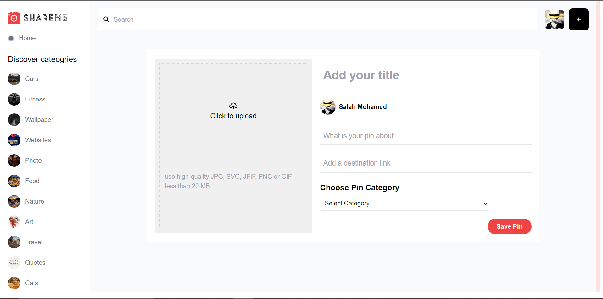
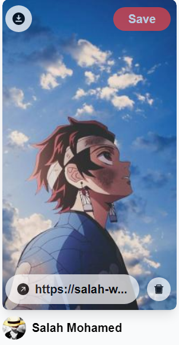
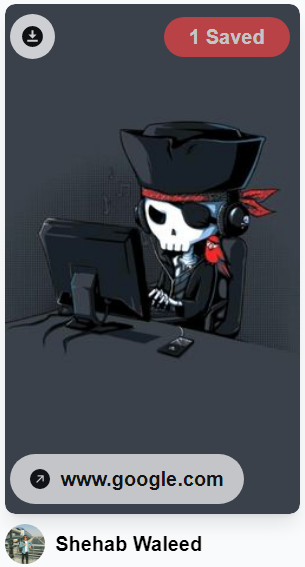
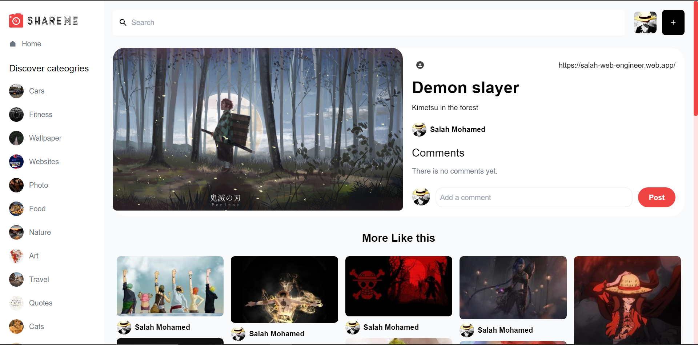
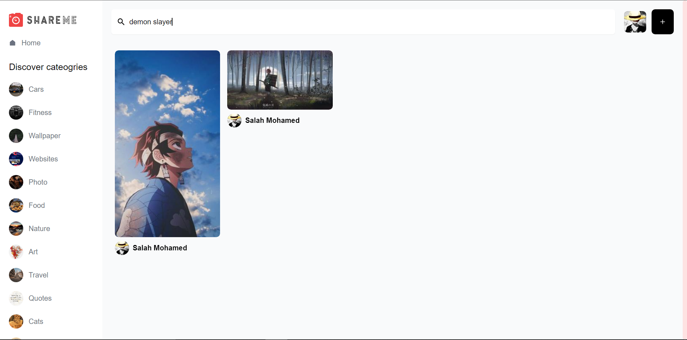
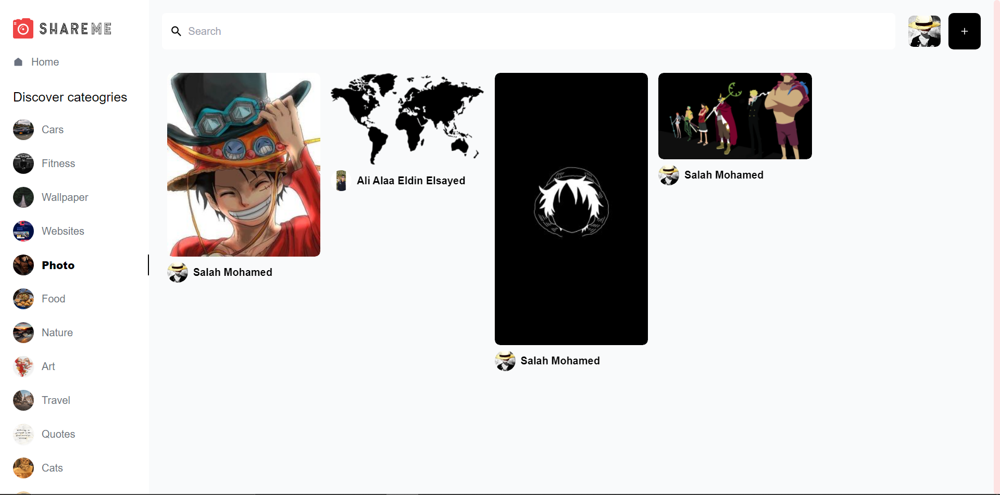
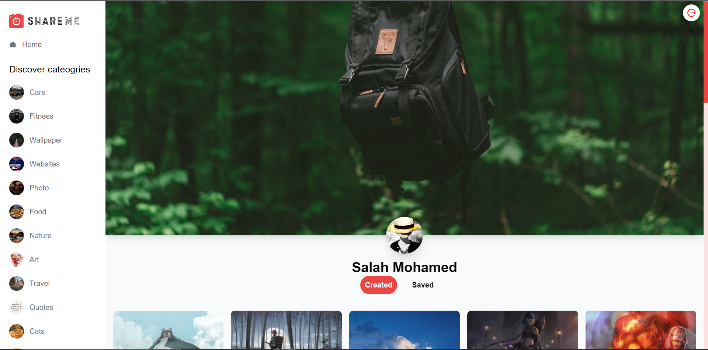

# ShareMe Social Media Application

This is a modern fullstack web application with all advansed social media such as google authentication, create, edit, delete and save images, like and comment to users posts, search and filter images and much more.

Built with:

- For frontend:
  - Reactjs for Main functionality.
  - tailwind to handle css and appearance.
  - React router dom package to divid project to individual routes.
  - React oauth/google to add the google authentication.
  - uuid package to make a unique ID for each pin.
  - React icons package to provide project icons.
  - React loader spinner package to provider the website loading spinner.
  - React Masonry css package to build the dynamic layout for pins.
- for backend: sanity.

[Live website](https://shareme-s.web.app/)

- Features:
  - Login With google 
    
  - Create new pin 
    
  - Save, Dawnload, click pin for it's details and Delete (if you are the user who posted it) 
    User's pin 
    
     
    Other's pin 
    
  - Pin detail page to show it's details, comments and more similar Pins 
    
  - search functionality 
    
  - See photos By it's category 
    
  - User's profile page (to see his creates and saved pins) 
    

[Live website](https://shareme-s.web.app/)
