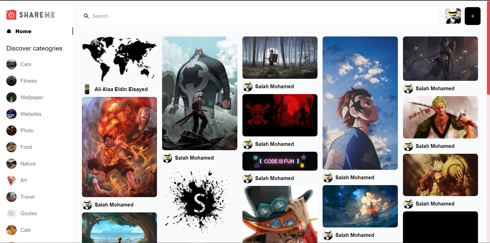

# ShareMe Social Media Application

This is a modern fullstack web application with all advansed social media such as google authentication, create, edit, delete and save images, like and comment to users posts, search and filter images and much more.

built with:

- for frontend: Reactjs and tailwind.
- for backend: sanity.
